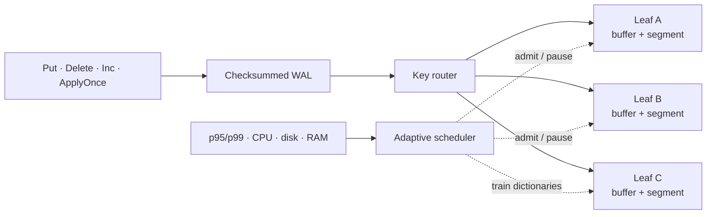

<p align="center">
  
</p>

<h1 align="center">FuseDB</h1>

<p align="center">
  An embedded key-value engine that keeps background maintenance local,
  adaptive, and observable.
</p>

<p align="center">
  <a href="https://github.com/uchebnick/fusedb/actions/workflows/ci.yml"></a>
  <a href="https://pkg.go.dev/github.com/uchebnick/fusedb/pkg/fusedb"></a>
  <a href="./LICENSE"></a>
  
</p>

<p align="center">
  <a href="./README.ru.md">Русский</a> ·
  <a href="./LIBRARY.md">API guide</a> ·
  <a href="./ARCHITECTURE.md">Architecture</a> ·
  <a href="./benchmarks/README.md">Benchmarks</a> ·
  <a href="./docs/README.md">Documentation</a>
</p>

> [!IMPORTANT]
> FuseDB is a research-stage engine. The public API and disk format may still
> evolve. Use it for experiments and rebuildable projections; do not make it
> the sole authority for payments, inventory, or other irreplaceable records.

## Why FuseDB exists

Large background compactions can turn a fast embedded database into an
unpredictable one. FuseDB explores a different maintenance unit: the keyspace
is divided into independently managed leaves. Each leaf owns a mutable buffer
and one immutable segment, so a merge rewrites a bounded local range rather
than coordinating work across the entire database.



This makes foreground latency and maintenance debt first-class parts of the
design instead of after-the-fact metrics.

## What is implemented

| Area | Current contract |
|---|---|
| Point operations | Concurrent `Get`, `Put`, `Delete`, and atomic `int64` `Inc` |
| Event application | Conditional multi-key batches and idempotent `ApplyOnce` in one WAL record |
| Durability | Checksummed WAL, exact per-leaf replay watermarks, group commit, crash recovery |
| Storage | Immutable block segments, bloom filters, local merge/split, LZ4 dictionaries |
| Scheduling | Load-aware admission and preemption using latency, CPU, disk, RAM, and learned traffic history |
| Operations | Verification, online backup/restore, format negotiation, Prometheus collector, Grafana dashboard |
| Validation | Race tests, fault injection, process-kill crash matrix, decoder fuzzing, phased qualification |

The supported scope is intentionally narrow: one local embedded database,
point access, and atomic write batches. Range scans, general read/write
transactions, replication, and a long-term cross-release format guarantee are
not implemented.

## Install

FuseDB requires Go 1.25.13+, a C toolchain, and the native LZ4 development
library.

```bash
# Debian / Ubuntu
sudo apt-get install liblz4-dev

# macOS
brew install lz4

go get github.com/uchebnick/fusedb/pkg/fusedb@latest
```

A `CGO_ENABLED=0` build compiles, but dictionary codecs and adaptive dictionary
training return `fusedb.ErrCGODisabled`.

## Quick start

```go
package main

import (
    "log"

    "github.com/uchebnick/fusedb/pkg/fusedb"
)

func main() {
    db, err := fusedb.Open(fusedb.DurablePilotOptions("./data"))
    if err != nil {
        log.Fatal(err)
    }
    defer db.Close()

    if err := db.Put([]byte("user:42"), []byte("Ada")); err != nil {
        log.Fatal(err)
    }

    value, found, err := db.Get([]byte("user:42"))
    if err != nil {
        log.Fatal(err)
    }
    if found {
        log.Printf("user:42 = %s", value)
    }
}
```

`DB` is safe for concurrent use. Writes copy caller-owned bytes before
publication, and reads return owned copies.

### Idempotent events

At-least-once delivery can atomically update membership and a materialized
counter without double-applying a retry:

```go
applied, err := db.ApplyOnceIf(
    []byte("event:like:evt-123"),
    []fusedb.Condition{
        fusedb.KeyAbsent([]byte("like:post-7:user-42")),
    },
    []fusedb.Mutation{
        fusedb.PutMutation([]byte("like:post-7:user-42"), []byte{1}),
        fusedb.IncMutation([]byte("likes:post-7:shard-12"), 1),
    },
)
```

The complete retry, key-schema, rebuild, and rollback model is documented in
the [likes and ticket-counter pilot wiki](./docs/pilot-likes-tickets.md).

## Durability

| Mode | A write returns after | Intended crash behavior |
|---|---|---|
| `WALSyncWrites: false` | WAL append and in-memory publication | The most recent group-commit window may be lost |
| `WALSyncWrites: true` | A coalesced WAL filesystem sync and publication | No successful WAL record is intentionally left unsynced |

`DurablePilotOptions` enables synchronous WAL durability, reserves host
headroom, samples foreground latency, and disables runtime dictionary training
until the deployment machine has been qualified.

## Adaptive maintenance

Merge, checkpoint, dictionary training/evaluation/GC, verification, backup, and
scheduler-model persistence are expressed as bounded background jobs. The
scheduler observes rolling request rate, p95/p99, CPU, disk throughput, memory,
maintenance urgency, and learned UTC time-of-week behavior.

It does not contain a hard-coded “run at night” rule. Stable low load can admit
expensive work at any hour; a spike can reduce or cooperatively cancel work.
Resource capacities are detected when not configured and can be overridden
explicitly. See [scheduler design](./docs/scheduler.md) and
[operations](./docs/operations.md).

## Benchmarks

The repository ships a single reproducible comparison harness for FuseDB,
Pebble, Badger, and native RocksDB. It runs identical deterministic point
workloads in separate `async` and `sync` durability profiles and emits raw,
versioned JSON plus a Markdown report.

```bash
make benchmark-quick

# Requires librocksdb and pkg-config.
make benchmark-rocksdb
```

Apple M4 snapshot, 20,000 × 256-byte keys/values, eight workers, median of
three runs:

| Profile / workload | FuseDB | Pebble | Badger | RocksDB |
|---|---:|---:|---:|---:|
| async / random read | 4.79M ops/s | 1.52M | 0.52M | 2.16M |
| async / 50:50 | 0.67M ops/s | 0.89M | 0.19M | 0.24M |
| async / overwrite | 1.08M ops/s | 0.58M | 0.17M | 0.13M |
| sync / overwrite | 2,033 ops/s | 1,056 | 20,683 | 1,137 |

This is not a universal ranking. FuseDB leads this small hot-set read and async
overwrite run; Pebble leads the concurrent async balanced/read-heavy mixes;
Badger's mmap/msync design is much faster in this machine's sync profile.
FuseDB's async read-heavy p99 under eight workers is `179 µs` versus `17 µs`
for Pebble, so throughput is not the whole result.

The [methodology](./benchmarks/README.md) explains cache targets, warmup,
workloads, native-library setup, limitations, and how not to over-interpret the
[latest recorded results](./benchmarks/RESULTS.md).

## Operability

- `DB.Health`, `DB.Stats`, `DB.Metrics`, and `DB.Format` expose immutable
  runtime snapshots.
- `pkg/fusedb/prometheus` provides an opt-in low-cardinality collector.
- [Prometheus alerts and Grafana dashboard](./monitoring/prometheus/README.md)
  cover foreground latency, WAL/merge debt, scheduler state, resource pressure,
  and failed background work.
- `cmd/fusedb-qualify` runs quiet → steady → spike → recovery phases and proves
  debt drainage, exact counters, verification, close, and reopen.
- Online backup archives only a manifest-consistent point in time and verifies
  restored content before publication.

## Documentation

| Guide | Use it for |
|---|---|
| [Library guide](./LIBRARY.md) | Public API, configuration, ownership, errors |
| [Architecture](./ARCHITECTURE.md) | Storage model, concurrency, merge and recovery invariants |
| [Scheduler](./docs/scheduler.md) | Load model, admission, preemption, resource budgets |
| [Compression](./docs/compression.md) | Dictionary grouping, training, evaluation and lifecycle |
| [Operations](./docs/operations.md) | Readiness boundaries, monitoring, backup and incidents |
| [Qualification](./docs/qualification.md) | Target-hardware load and recovery evidence |
| [Disk format](./docs/format.md) | Epochs, features and migration contract |
| [Benchmark methodology](./benchmarks/README.md) | Reproducible cross-engine comparison |
| [Pilot wiki](./docs/pilot-likes-tickets.md) | Likes and purchased-ticket projection pattern |

The [documentation index](./docs/README.md) groups every maintained guide by
audience.

## Repository layout

| Path | Responsibility |
|---|---|
| `pkg/fusedb` | Supported public API |
| `internal/tree`, `internal/leaf` | Routing, bounded merge, split, and publication |
| `internal/wal`, `internal/manifest` | Durability, replay, catalog, and watermarks |
| `internal/segment`, `internal/compression` | Immutable format and adaptive LZ4 dictionaries |
| `internal/scheduler`, `internal/metrics` | Background admission and reusable telemetry |
| `internal/backup`, `internal/disk` | Verified archives and filesystem primitives |
| `cmd/fusedb-qualify` | Deployment qualification CLI |
| `benchmarks` | Isolated comparison module; no benchmark dependencies leak into the library |
| `monitoring` | Prometheus rules and Grafana assets |

## Development

```bash
make check
make test-crash
make test-fuzz
make security
make test-benchmarks
```

See [CONTRIBUTING.md](./CONTRIBUTING.md) for focused test commands and engine
invariants. Security reports follow [SECURITY.md](./SECURITY.md).

FuseDB is licensed under the [MIT License](./LICENSE).
