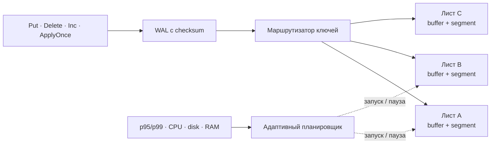

<p align="center">
  
</p>

<h1 align="center">FuseDB</h1>

<p align="center">
  Встраиваемая key-value база с локальными merge, адаптивным обслуживанием
  и контролем foreground latency.
</p>

<p align="center">
  <a href="https://github.com/uchebnick/fusedb/actions/workflows/ci.yml"></a>
  <a href="https://pkg.go.dev/github.com/uchebnick/fusedb/pkg/fusedb"></a>
  <a href="./LICENSE"></a>
  
</p>

<p align="center">
  <a href="./README.md">English</a> ·
  <a href="./LIBRARY.md">API</a> ·
  <a href="./ARCHITECTURE.ru.md">Архитектура</a> ·
  <a href="./benchmarks/README.md">Бенчмарки</a> ·
  <a href="./docs/README.md">Документация</a>
</p>

> [!IMPORTANT]
> FuseDB находится на исследовательской стадии: API и дисковый формат ещё могут
> меняться. Её можно использовать для экспериментов и перестраиваемых
> проекций, но не как единственный источник истины для платежей, inventory и
> других невосстановимых данных.

## Идея

Большой compaction способен превратить быструю embedded-базу в
непредсказуемую. FuseDB делит keyspace на независимо обслуживаемые листья.
Каждый лист владеет mutable-буфером и одним immutable-сегментом, поэтому merge
переписывает ограниченный локальный диапазон, а не всю базу.



Планировщик учитывает текущую нагрузку, p95/p99, CPU, диск, память,
maintenance debt и выученный недельный профиль. В нём нет жёсткого правила
«обучаться ночью»: тяжёлая работа запускается при устойчиво низкой нагрузке и
сокращается или прерывается во время спайка.

## Реализовано

| Область | Текущий контракт |
|---|---|
| Point API | Конкурентные `Get`, `Put`, `Delete` и атомарный `int64` `Inc` |
| События | Условные multi-key batches и идемпотентный `ApplyOnce` одним WAL-record |
| Durability | Checksummed WAL, group commit, точные replay watermarks и crash recovery |
| Хранение | Immutable-сегменты, bloom filter, локальные merge/split, LZ4-словари |
| Планирование | Admission и preemption по latency, CPU, disk, RAM и истории нагрузки |
| Эксплуатация | Verify, backup/restore, Prometheus, Grafana и format negotiation |
| Проверка | Race, fault injection, process-kill crash matrix, fuzz и phased qualification |

Scope пока намеренно ограничен одной локальной базой, point-операциями и
атомарными write batches. Range scan, общих read/write-транзакций, репликации и
долгосрочной гарантии совместимости форматов пока нет.

## Установка

Нужны Go 1.25.13+, C toolchain и development-библиотека LZ4.

```bash
# Debian / Ubuntu
sudo apt-get install liblz4-dev

# macOS
brew install lz4

go get github.com/uchebnick/fusedb/pkg/fusedb@latest
```

Сборка с `CGO_ENABLED=0` работает, но dictionary codec и обучение словарей
возвращают `fusedb.ErrCGODisabled`.

## Быстрый старт

```go
package main

import (
    "log"

    "github.com/uchebnick/fusedb/pkg/fusedb"
)

func main() {
    db, err := fusedb.Open(fusedb.DurablePilotOptions("./data"))
    if err != nil {
        log.Fatal(err)
    }
    defer db.Close()

    if err := db.Put([]byte("user:42"), []byte("Ada")); err != nil {
        log.Fatal(err)
    }

    value, found, err := db.Get([]byte("user:42"))
    if err != nil {
        log.Fatal(err)
    }
    if found {
        log.Printf("user:42 = %s", value)
    }
}
```

`DB` безопасна для конкурентного использования. Записи копируют
caller-owned bytes, чтения возвращают независимые копии.

## Идемпотентные события

Повторная доставка события может атомарно обновить membership и шардированный
счётчик без двойного применения:

```go
applied, err := db.ApplyOnceIf(
    []byte("event:like:evt-123"),
    []fusedb.Condition{
        fusedb.KeyAbsent([]byte("like:post-7:user-42")),
    },
    []fusedb.Mutation{
        fusedb.PutMutation([]byte("like:post-7:user-42"), []byte{1}),
        fusedb.IncMutation([]byte("likes:post-7:shard-12"), 1),
    },
)
```

Схема ключей, retry-контракт, rebuild и rollback описаны в
[wiki для лайков и счётчика билетов](./docs/pilot-likes-tickets.ru.md);
[подробная английская версия](./docs/pilot-likes-tickets.md) содержит полный
production-pilot runbook.

## Durability

| Режим | Когда завершается запись | Поведение при crash |
|---|---|---|
| `WALSyncWrites: false` | После WAL append и публикации в памяти | Может потеряться последнее окно group commit |
| `WALSyncWrites: true` | После coalesced filesystem sync WAL | Успешные WAL-record намеренно не остаются unsynced |

`DurablePilotOptions` включает sync WAL, оставляет headroom железу, собирает
latency и отключает runtime-обучение словарей до qualification на целевой
машине.

## Сравнительные бенчмарки

В репозитории остался один воспроизводимый harness для FuseDB, Pebble, Badger и
нативного RocksDB. Он разделяет `async` и `sync`, запускает одинаковые
детерминированные workloads и сохраняет versioned JSON вместе с Markdown.

```bash
make benchmark-quick

# Нужны librocksdb и pkg-config.
make benchmark-rocksdb
```

Читайте [методологию](./benchmarks/README.md) перед
[результатами](./benchmarks/RESULTS.md): короткий hot-key benchmark не
проверяет recovery, backups, долгие compaction stalls или зрелость продукта.

## Документация

| Раздел | Содержание |
|---|---|
| [Library guide](./LIBRARY.md) | API, настройки, ownership и ошибки |
| [Архитектура](./ARCHITECTURE.ru.md) | Модель хранения и инварианты конкурентности |
| [Планировщик](./docs/scheduler.md) | Нагрузка, admission, preemption и resource budgets |
| [Compression](./docs/compression.md) | Группы словарей, обучение, оценка и GC |
| [Operations](./docs/operations.md) | Monitoring, backup, readiness и incidents |
| [Qualification](./docs/qualification.md) | Проверка нагрузки и recovery на целевом железе |
| [Disk format](./docs/format.md) | Epoch, feature bits и миграции |
| [Benchmarks](./benchmarks/README.md) | Честное сравнение движков |

Полный каталог находится в [docs/README.md](./docs/README.md).

## Разработка

```bash
make check
make test-crash
make test-fuzz
make security
make test-benchmarks
```

Правила разработки и focused tests находятся в
[CONTRIBUTING.md](./CONTRIBUTING.md), security policy — в
[SECURITY.md](./SECURITY.md). Лицензия — [MIT](./LICENSE).
