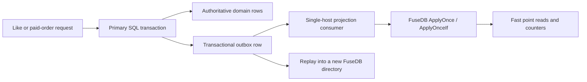

# Likes and purchased-ticket counters: durable pilot wiki

This document is the deployment and application contract for using FuseDB as a
local projection for likes and purchased-ticket counters. It covers the exact
API added for this workload, the invariants the application must preserve, and
the operational gates required before traffic is enabled.

> FuseDB is not the payment, order, or inventory system of record. Keep those
> records in a transactional primary database. Deliver committed changes to
> FuseDB through a transactional outbox with stable event IDs. The projection
> must remain fully rebuildable.

The complete adapter is runnable Go code in
[`examples/likes-tickets/store.go`](../examples/likes-tickets/store.go). The
short Russian runbook is in
[`pilot-likes-tickets.ru.md`](./pilot-likes-tickets.ru.md).

## 1. Safety boundary

### Supported pilot responsibilities

- Store one point-addressable membership key per `(object, user)` like.
- Materialize sharded like counters for fast display.
- Store a projection of a paid order.
- Materialize sharded purchased-ticket counters.
- Atomically update a membership/order key and its counter shard.
- Deduplicate at-least-once event delivery with a stable idempotency key.
- Recover an atomic batch after process death, merge, checkpoint, and reopen.

### Responsibilities that must stay outside FuseDB

- Authorizing or capturing a payment.
- Enforcing ticket inventory or preventing overselling.
- Creating the authoritative order.
- Coordinating changes with another database in a distributed transaction.
- Multi-node replication, leader election, or automated failover.
- Ad-hoc scans, reports, and historical event queries.

The recommended data flow is:



Never acknowledge or delete an outbox row before FuseDB returns either:

- `applied=true, err=nil`; or
- `applied=false, err=nil`, meaning the event was already decided or its
  first condition evaluation was a no-op.

An `ErrIdempotencyConflict` is not success. Quarantine the event because its ID
was reused with different content.

## 2. Atomic write API

FuseDB format epoch 3 adds a bounded WAL batch record. One record contains a
single sequence number, checksum, and up to 4,096 validated Put/Delete/Inc
members. The public API reserves one member for the idempotency marker, so a
caller may submit at most 4,095 mutations.

### `Apply`

```go
applied, err := db.Apply(conditions, mutations)
```

All conditions are evaluated while conflicting keys are excluded. When every
condition matches, all mutations are appended in one WAL record and published
through one visibility boundary. If any condition fails, the method returns
`false, nil` and does not write anything.

Available conditions:

- `fusedb.KeyAbsent(key)`
- `fusedb.KeyPresent(key)`

Available mutations:

- `fusedb.PutMutation(key, value)`
- `fusedb.DeleteMutation(key)`
- `fusedb.IncMutation(key, delta)`

A transaction may mutate each key only once. Byte values and integer counters
remain different types; incrementing a byte-valued key returns
`fusedb.ErrValueType` before WAL append.

### `ApplyOnce`

```go
applied, err := db.ApplyOnce(idempotencyKey, mutations)
```

The first successful call stores a versioned SHA-256 digest of the ordered
mutation set under `idempotencyKey` in the same atomic batch.

- Same key and same ordered mutations: `false, nil`.
- Same key and different mutations: `false, ErrIdempotencyConflict`.
- New key: commit the marker and mutations, then return `true, nil`.

The idempotency key is a normal FuseDB byte key. Dedicate an `event/...`
namespace to it and never modify those keys with ordinary `Put` or `Delete`.

### `ApplyOnceIf`

```go
applied, err := db.ApplyOnceIf(idempotencyKey, conditions, mutations)
```

This combines stable event deduplication with presence conditions. On the first
call, FuseDB persists the decision even when a condition is false. That detail
prevents this failure sequence:

1. an unlike arrives while the membership is absent;
2. the unlike is correctly treated as a no-op;
3. the user creates a new like;
4. a delayed retry of the old unlike arrives;
5. without a persisted negative decision, it would delete the newer like.

With `ApplyOnceIf`, step 4 returns `false, nil` and leaves newer state intact.

`applied=false` intentionally combines two safe outcomes: a duplicate event or
a first evaluation whose condition did not match. The outbox consumer may ack
both. If the product needs to distinguish them, store that business outcome in
the authoritative system; do not infer it from a second FuseDB read.

## 3. Key schema

Use a versioned, collision-free schema. The example encodes every external ID
with unpadded base64url before joining components.

| Purpose | Logical shape |
|---|---|
| Idempotency marker | `event/<base64url-event-id>` |
| Like membership | `like/<object-id>/<user-id>` |
| Like counter shard | `like-count/<object-id>/<00..63>` |
| Purchase projection | `purchase/<order-id>` |
| Ticket counter shard | `tickets-sold/<event-object-id>/<00..63>` |

Do not build keys by concatenating unescaped caller strings with `/`; different
input tuples can otherwise map to the same byte key.

### Why counters are sharded

Every update to one counter key is ordered, which is required for exact integer
semantics but makes a single hot key a synchronous-WAL bottleneck. The example
uses 64 deterministic shards:

- like shard = `FNV-1a(userID) mod 64`;
- ticket shard = `FNV-1a(orderID) mod 64`.

Reading the displayed total performs 64 point reads and sums them. The shard
count is part of the persistent schema. Choose it before launch and change it
only by rebuilding the projection into a new directory.

Sharded reads are not transactional snapshots. While purchases are arriving,
a total may combine shard values from slightly different instants. It remains
monotonic for positive-only ticket updates and converges to the exact total.
Use the primary database for a legally or financially authoritative total.

## 4. Like and unlike flows

### Like

```go
likeKey := []byte("like/post-42/user-7")
counterShard := []byte("like-count/post-42/17")

applied, err := db.ApplyOnceIf(
    []byte("event/evt-like-01932"),
    []fusedb.Condition{fusedb.KeyAbsent(likeKey)},
    []fusedb.Mutation{
        fusedb.PutMutation(likeKey, []byte("2026-08-19T18:00:00Z")),
        fusedb.IncMutation(counterShard, 1),
    },
)
```

The membership and counter shard are either both committed or neither is.
Repeated delivery of `evt-like-01932` never increments twice.

### Unlike

Use a new event ID and the same deterministic counter shard:

```go
applied, err := db.ApplyOnceIf(
    []byte("event/evt-unlike-01987"),
    []fusedb.Condition{fusedb.KeyPresent(likeKey)},
    []fusedb.Mutation{
        fusedb.DeleteMutation(likeKey),
        fusedb.IncMutation(counterShard, -1),
    },
)
```

Ordering still belongs to the authoritative event stream. If events for the
same `(object, user)` can be processed concurrently by several consumers,
partition the stream by that tuple or attach a domain version in the primary
system. Presence checks prevent duplicate state transitions; they do not sort
arbitrarily reordered business events.

## 5. Purchased-ticket flow

```go
applied, err := db.ApplyOnce(
    []byte("event/purchase-paid/order-991"),
    []fusedb.Mutation{
        fusedb.PutMutation([]byte("purchase/order-991"), []byte("paid")),
        fusedb.IncMutation([]byte("tickets-sold/show-55/08"), 3),
    },
)
```

The event ID must identify the authoritative purchase event, not an HTTP
attempt. Every delivery retry must reuse the same ID and byte-identical ordered
mutations. Normalize payloads before building mutations; timestamps generated
during each retry would change the digest and correctly cause a conflict.

Refunds or cancellations should be separate authoritative events with their
own stable IDs and negative counter deltas. Whether a refund is allowed is a
primary-database decision.

## 6. Opening with fail-safer defaults

```go
options := fusedb.DurablePilotOptions("/var/lib/my-service/fusedb")

// Set measured/effective capacity for the actual container or host.
options.Scheduler.CPUCores = 4
options.Scheduler.MemoryBytes = 4 << 30
options.Scheduler.DiskBytesPerSecond = 250 << 20

// Replace these with the service SLO.
options.Scheduler.TargetReadP99 = 10 * time.Millisecond
options.Scheduler.TargetWriteP99 = 50 * time.Millisecond

db, err := fusedb.Open(options)
if err != nil {
    return err
}
```

`DurablePilotOptions` sets:

| Setting | Value | Reason |
|---|---:|---|
| `WALSyncWrites` | `true` | Do not intentionally acknowledge an unsynced event |
| CPU ceiling | `0.70` | Preserve foreground and host headroom |
| Disk ceiling | `0.70` | Avoid maintenance saturating storage |
| Memory ceiling | `0.70` | Avoid approaching container/host exhaustion |
| Latency sampling | 1/16 operations | Observe p95/p99 with bounded overhead |
| Dictionary training | disabled | Remove an unqualified background variable on day one |

Zero capacity values still auto-detect CPU/RAM and learn database I/O
throughput. For a controlled deployment, explicit container-aware values are
preferable. Set `GOMEMLIMIT` consistently with the container limit.

Do not use NFS, a shared network filesystem, or one directory mounted by two
instances. FuseDB takes an advisory `<Dir>/LOCK` and supports one live process
per directory.

## 7. Scheduler and maintenance behavior

Merge, checkpoint, verification, backup, dictionary work, and model persistence
share one scheduler. It observes actual request rate, sampled p95/p99, resource
utilization, and a learned UTC time-of-week baseline. It does not use a fixed
"run at night" rule.

- Optional training/evaluation requires a confirmed stable quiet window.
- Busy or overloaded foreground state preempts optional work.
- Merge debt increases job urgency.
- A hard WAL checkpoint limit is mandatory and may run during load to preserve
  bounded recovery debt.
- Resource ceilings apply before optional admission.

For the first deployment, keep dictionary training disabled. Enable it only
after a target-machine soak demonstrates stable p95/p99 during forced merge and
checkpoint debt. A pre-trained dictionary is also optional; correctness never
depends on compression gain.

## 8. Error and retry contract

Always inspect every mutation error.

### Ordinary validation errors

- `ErrEmptyKey`, `ErrKeyTooLarge`, `ErrValueTooLarge`: reject the event as a
  producer/schema error; nothing reached the WAL.
- `ErrValueType`: quarantine a schema collision between byte data and a counter.
- `ErrDuplicateMutationKey`: fix the transaction builder.
- `ErrIdempotencyConflict`: quarantine; the same event ID has different content.

### Terminal persistence errors

Errors matching `ErrWALPersistence` or `ErrCommitUncertain` fence the handle.
Immediately:

1. stop accepting projection traffic;
2. make readiness fail;
3. close the handle and record the close error;
4. reopen the same directory;
5. retry the event with the same idempotency key and identical mutations.

After an uncertain commit, the batch may be present or absent. The checksummed
single WAL record plus `ApplyOnce` makes the prescribed retry safe in both
cases. Never generate a new event ID for that retry.

### Background terminal errors

A failed merge/manifest/checkpoint commit also makes `DB.Health().Ready` false.
Do not continue on the same handle. Reopen reconciles manifest-rooted segments
and replays the WAL.

## 9. Crash-consistency model

One batch has one WAL sequence number. Independent leaf merges may persist
different members before a crash. Each manifest leaf stores its exact applied
sequence watermark. On reopen:

1. FuseDB validates the WAL record checksum and structure.
2. It decodes every bounded batch member.
3. For each member, it checks the watermark of the leaf that currently owns
   that member's key.
4. It replays only members not already covered by that leaf.
5. The database handle is published only after replay completes.

This prevents a counter member from being applied twice when another member of
the same batch was merged into a different leaf before process death.

The test matrix kills a subprocess after WAL write/sync, segment sync/rename,
manifest sync/rename, and WAL-rotation sync/rename. The recovery test requires
the order, idempotency marker, and counter to converge to one complete event.

## 10. Monitoring

Expose `DB.Health()` through readiness and register the optional
`pkg/fusedb/prometheus` collector. At minimum alert on:

- any increase in terminal or commit-uncertain errors;
- any failed background job;
- sustained `busy` or `overloaded` scheduler state;
- read/write p95 or p99 above the application SLO;
- growing buffered bytes, WAL debt, or pending merge leaves without progress;
- CPU, disk, or memory utilization at its configured ceiling;
- time since the last successful merge/checkpoint/backup;
- any `Verify` corruption result.

Track application-level metrics separately:

- outbox lag and oldest unacknowledged event age;
- idempotency conflicts;
- first-evaluation conditional no-ops;
- projection rebuild duration;
- sampled difference between primary and projected totals.

## 11. Backup, rebuild, and rollback

Use `DB.Backup`; never copy a live directory. Regularly restore archives into a
new directory and run `Verify` before considering the drill successful.

The authoritative recovery path is still a rebuild:

1. create a new empty directory on the target volume;
2. open it with the exact pinned FuseDB build;
3. replay the primary snapshot and ordered outbox history with stable event IDs;
4. compare membership samples and all authoritative counters;
5. run `DB.Verify`;
6. atomically switch the application path/configuration to the new directory;
7. retain the old directory until the new projection passes observation.

Rollback means disabling projection reads and falling back to the primary
system or a previous verified projection. Never downgrade-open an epoch-3
directory with an older binary that does not understand atomic WAL batches.

## 12. Idempotency-marker retention

Every unique event permanently creates one marker key. FuseDB currently has no
TTL or range-delete API. Capacity planning must therefore include marker keys,
and the primary outbox must remain the rebuild source.

Do not delete a marker while its event can still be redelivered. If retention
must be bounded, rotate the complete projection by rebuilding into a new
directory from an authoritative snapshot at a known event watermark. This is
safer than deleting individual markers without a transactional agreement with
the producer.

## 13. Qualification command

Run on the same filesystem, container limits, Go build, and machine class as
the intended instance. Replace rates and SLOs with production values:

```bash
go run ./cmd/fusedb-qualify \
  -dir /mnt/fusedb-qualification/run-001 \
  -workers 32 \
  -keys 500000 \
  -value-bytes 512 \
  -steady-qps 10000 \
  -spike-qps 40000 \
  -cpu-cores 8 \
  -memory-bytes 8589934592 \
  -disk-bytes-per-second 400000000 \
  -max-cpu-utilization 0.70 \
  -max-disk-utilization 0.70 \
  -max-memory-utilization 0.70 \
  -max-read-p99 20ms \
  -max-write-p99 50ms \
  -wal-sync-writes=true \
  > qualification-001.json
```

Also run the application-specific synchronous batch benchmark:

```bash
go test ./pkg/fusedb \
  -run '^$' \
  -bench '^BenchmarkApplyOncePurchaseSyncWAL$' \
  -benchmem \
  -benchtime=10s \
  -count=3
```

Do not approve capacity from the benchmark alone. The qualification must force
maintenance debt, include a spike and recovery period, close/reopen the data,
and validate every expected counter.

## 14. Pre-traffic checklist

- [ ] Primary SQL rows and transactional outbox are deployed and tested.
- [ ] Event IDs are stable across retries and globally unique in the namespace.
- [ ] Same-key events are partitioned or ordered by the consumer.
- [ ] Key encoding is collision-free and the 64-shard schema is frozen.
- [ ] The exact Git commit, Go toolchain, CGO mode, and LZ4 version are pinned.
- [ ] `DurablePilotOptions` is used with explicit target capacities.
- [ ] Data directory is on a dedicated local filesystem with sufficient space.
- [ ] Full tests, race tests, crash matrix, fuzzers, vulnerability scan, and
  license gate pass from the release candidate checkout.
- [ ] Target-machine qualification passes the actual QPS and p99 gates.
- [ ] Readiness and all critical alerts were exercised in staging.
- [ ] Backup restore and outbox rebuild were timed and verified.
- [ ] Rollback to primary reads can be activated without a code release.
- [ ] Initial traffic is canary-limited and projected totals are compared with
  the primary system.

## 15. Current verified coverage

The repository contains focused evidence for this contract:

- WAL batch codec round-trip, malformed-input rejection, and fuzz target;
- concurrent duplicate delivery applies one purchase exactly once;
- 800 distinct concurrent purchase events remain exact after reopen;
- conditional like plus counter update applies once;
- a rejected `ApplyOnceIf` decision survives newer state;
- idempotency conflicts fail closed;
- 500 batches survive merge, close, reopen, and full `Verify`;
- deterministic ENOSPC, partial-write, and fsync fault recovery;
- subprocess death across all storage commit boundaries with keys spanning
  independently merged leaves;
- race detector coverage of the public transaction path.

These tests establish the implementation contract. They do not replace a
long-duration soak, power-loss qualification, or application-level invariant
checking on the deployment hardware.
